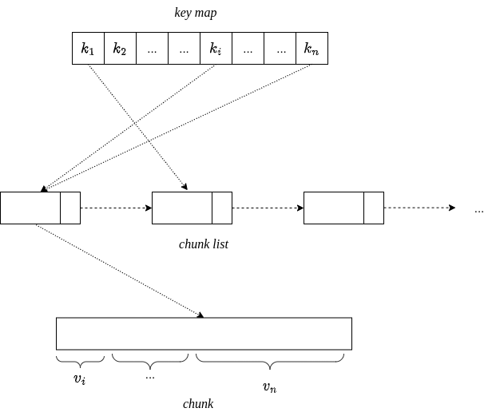

# zipcache
An in-memory compressed cache

# Why?

Caching many items in memory can considerably increase the space requirements of an application. A simple way to mitigate this problem is to compress each cache entry using some compression algorithm (deflate, gzip, etc...). Howewer this approach is not effective when the average size of each entry is relatively small.

## ZipCache Layout
The goal of ZipCache is to achieve a better compression rate by arranging multiple values (represented as **byte slices**) within a single byte chunk, whose maximum size is fixed (**4096** by default). Values are appended in the current chunk in the same order are they are inserted. When a chunk is full, a new one is appended to the **chunk list** and the old one gets compressed in the background. Values whose size exceeds the chunk size are split across multiple blocks. A separate map is kept (which is a standard golang **map**) to easily locate values within blocks, which associates a key to a triplet **<chunkNumber, byteOffset, length>**.

<p align="center">
  
</p>


# Sample use case

Suppose you want to cache a set of json encoded entries of relatively small size.

Let's try to firstly follow the naive approach, where each entry is compressed separatedly and stored in a standard golang map. 

```golang
package main

...

func main() {
	f, err := os.Open("../airlines.json")
	fatalIfErr(err)

	data, err := io.ReadAll(f)
	fatalIfErr(err)

	m := make(map[string]string)

	x := make([]map[string]any, 0)
	err = json.Unmarshal(data, &x)
	fatalIfErr(err)

	totalTime := time.Now()
	for i, item := range x {
		data, err := json.Marshal(item)
		fatalIfErr(err)

		start := time.Now()
		m[strconv.Itoa(i)] = string(compress(data))
		totalTime += time.Since(start)
		fatalIfErr(err)
	}

	size := 0
	for _, v := range m {
		size += len(v)
	}
	fmt.Printf("time (seconds):\t %f\n", totalTime.Seconds())
	fmt.Printf("ratio (%%):\t %.2f\n", float64(size)/float64(len(data)))
}

```
The output is the following:

```bash
time (seconds):	 1.503385
ratio (%):	 0.34
```

Now, let's try to use ZipCache to accomplish the same task.

```golang

import (
	...
	"github.com/ostafen/zipcache"
)

...

func main() {
	f, err := os.Open("./airlines.json")
	fatalIfErr(err)

	data, err := io.ReadAll(f)
	fatalIfErr(err)

	cache := zipcache.New(zipcache.Config{
		ChunkSize:    4096 * 4, // defines how many entries will be compressed together. It depends on the average entry size.
		ChunkMinGain: 0.05, // compress if we gain at least 5% of space by compressing a block (same as default)
	})

	x := make([]map[string]any, 0)
	err = json.Unmarshal(data, &x)
	fatalIfErr(err)

	total := time.Duration(0)
	for i, item := range x {
		data, err := json.Marshal(item)
		fatalIfErr(err)

		start := time.Now()
		err = cache.Put([]byte(strconv.Itoa(i)), data)
		total += time.Since(start)
		fatalIfErr(err)
	}

	fmt.Printf("time (seconds):\t %f\n", total.Seconds())
	fmt.Printf("ratio (%%):\t %.2f\n", float64(cache.Size())/float64(len(data)))
}
```

This is what we get:

```bash
time (seconds):	 0.006377
ratio (%):	 0.11
```

Not only we save about 23% additional space, but code is ~200x faster, since compression is invoked less times.

# Limitations

ZipCache is a grow-only cache. Cache items are not evicted and mappings cannot be updated nor deleted. However, support for update/deletion is planned.

